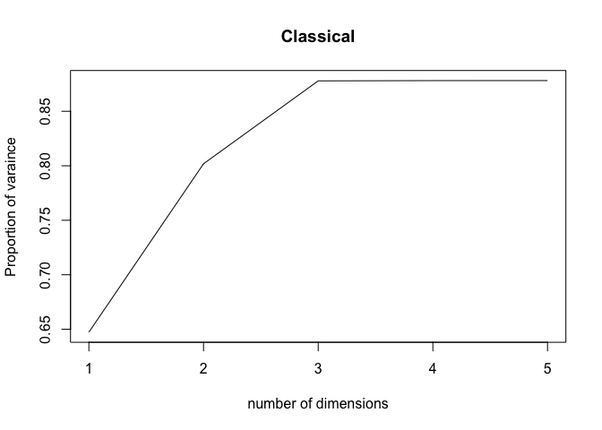
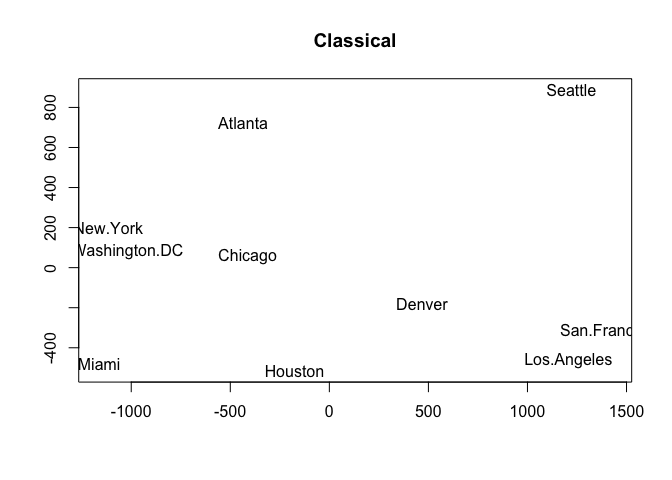
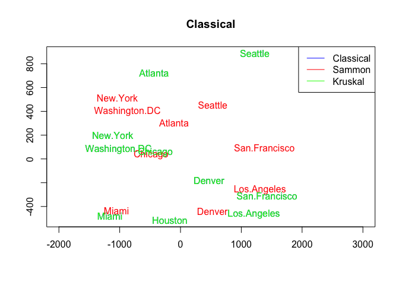
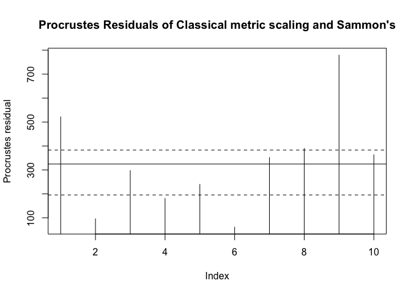
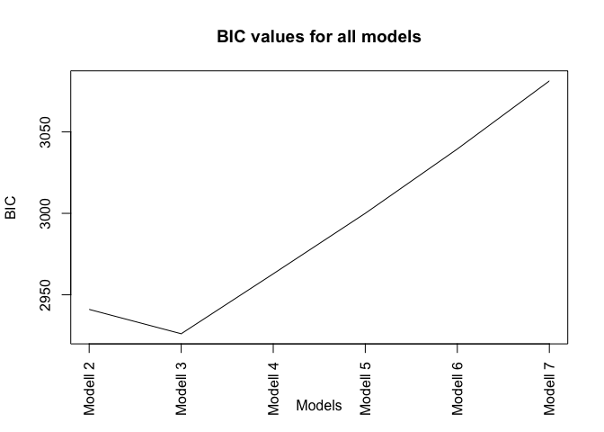

-----

## output: rmarkdown::github\_document

\#\#Question 1 :

\#1.(a)

``` r
#Loading the dataset.

airlinedata = read.csv("airlinedata.csv")

# adding the rownames same as column names
rownames(airlinedata) <- colnames(airlinedata)


#vector to store the different proportion of variances. 
PropVariance = rep(0,5)

# Loop to calculate the Proportion os variance for different dimensions
for (variable in 1:length(PropVariance)) {

  loc = cmdscale(airlinedata, k=variable, eig=TRUE)
  PropVariance[variable] = sum(abs(loc$eig[1:variable]))/sum(abs(loc$eig))
    
}


#Plot showing how much proportion of varaince is explained by each dimension
plot(1:5, PropVariance, type = "l", xlab = "number of dimensions" , ylab = "Proportion of varaince", main="Classical")
```

<!-- -->

``` r
print("Maximum proportion of variance is explained till dimension equal to 3 and thereafter there is less proportion exaplined, so we are considering 3 as suitable number of dimensions required to represent the data")
```

    ## [1] "Maximum proportion of variance is explained till dimension equal to 3 and thereafter there is less proportion exaplined, so we are considering 3 as suitable number of dimensions required to represent the data"

``` r
# Two dimensional configuration of classical metric scaling.
loc1 = cmdscale(airlinedata, k=2, eig=TRUE)

#Storing the x-axis points
x = loc1$points[,1]

#Storing the y-axis points
y = loc1$points[,2]

#Ploting 2 dimesional configuration and labeling each point by city names
plot(x, y, type="n", xlab="", ylab="", main="Classical")
text(x, y, rownames(airlinedata), cex=1)
```

<!-- -->

\#1.(b)

``` r
library(MASS)

#Sammon metric least square
loc2 <- sammon(data.matrix(airlinedata), k = 2)
```

    ## Initial stress        : 0.20405
    ## stress after  10 iters: 0.06481, magic = 0.500
    ## stress after  20 iters: 0.06424, magic = 0.500
    ## stress after  30 iters: 0.06421, magic = 0.500

``` r
#Kruskal non-metric scaling
loc3 <- isoMDS(data.matrix(airlinedata), k = 2)
```

    ## initial  value 13.924662 
    ## final  value 13.924497 
    ## converged

``` r
#Plot which include all the 3 MDS.
plot(x, y, type="n", xlab="", ylab="", main="Classical",xlim=c(-2000,3000))
text(x, y, rownames(airlinedata), cex=1, col = "Blue")
text(loc2$points[,1], loc2$points[,2], rownames(airlinedata), cex=1, col = "Red")
text(loc3$points[,1], loc3$points[,2], rownames(airlinedata), cex=1, col = "Green")
legend("topright", legend = c("Classical","Sammon","Kruskal"), col = c("Blue","Red","Green"),lty = 1)
```

<!-- -->

``` r
#print("Here we see that Sammon metric and Classical metric scaling produce same ouput, hence they we see the overlapping on the output of the two methods")
```

\#1.(c)

``` r
#Library to work on procrustes
library(vegan)
```

    ## Loading required package: permute

    ## Loading required package: lattice

    ## This is vegan 2.5-5

``` r
#procrustes of classical and Sammon's 
proc12 = procrustes(loc1$points, loc2$points)

#Procrustes of Sammon's and Kruskal's
proc23 = procrustes(loc2$points, loc3$points)

#Procrustes of Kruskal and Classical metric scaling
proc31 = procrustes(loc3$points, loc1$points)

#Procrustes Sum of Squares.
x <- rep(0,3)

x[1] <- proc12$ss
x[2] <- proc23$ss
x[3] <- proc31$ss

#Calculating minimum of above procrustes values.
c <- 0 
c <- which.min(x)

c
```

    ## [1] 3

``` r
#Printing the best match models
print(switch(c, "Classical metric scaling and Sammon's metric least square are best match", "Sammon's  metric least square and Kruskal non-metric are the best match","Kruskal non-metric and Classical metric scaling are best match" ))
```

    ## [1] "Kruskal non-metric and Classical metric scaling are best match"

``` r
#Procrustes Residual plots.
plot(proc12, kind=2, main = "Procrustes Residuals of Classical metric scaling and Sammon's")
```

<!-- -->

``` r
plot(proc23, kind=2, main = "Procrustes Residuals of Sammon's and Kruskal's")
```

<!-- -->

``` r
plot(proc31, kind=2, main = "Procrustes Residuals of Kruskals and Calssical metric scaling")
```

<!-- -->

\#\#Question 2:

\#2.(a)

``` r
# Library to work on hierarchical clustring
library(ade4)
#Reading the dataset
ScienceTech = read.csv("ScienceTechSurvey.csv")
ScienceTech1 <- ScienceTech

#hierarchical clustring using complete methods.
#Here we are using not using average method as using average tell us that only 2 clusters would be best but number of observations in one cluster is much less than other cluster
#Similar issue using single method in hclust.
#Complete method shows us clearly that four cluster would be best.
#Here we are using Jacard dist method
cl.complete = hclust(dist.binary(ScienceTech1, method = 1), method="complete")
plot(cl.complete)#Plot the dendrogram 
```

<!-- -->

``` r
hcl = cutree(cl.complete, k = 4) #Cutting the dendrogram so that we obtain 4 clusters
table(hcl)#Table of values shows number of observations in each cluster
```

    ## hcl
    ##   1   2   3   4 
    ## 339  20  29   4

``` r
"Hence i think there are 4 clusters of respondents for this data using hierarchical clustring"
```

    ## [1] "Hence i think there are 4 clusters of respondents for this data using hierarchical clustring"

\#2.(b):

``` r
library(poLCA)
```

    ## Loading required package: scatterplot3d

``` r
#Converting postive response to science and technology to 2
ScienceTech[ScienceTech == 1] <- 2

#Converting negative response to science and technology to 1 as poLCA accepts only non-zero integer values
ScienceTech[ScienceTech == 0] <- 1

#Formula expression. 
f <- cbind(Comfort,Environment,Work,Future,Technology,Industry,Benefit) ~ 1

#mininum Bic value is set to some random number to find minimum number of clusters.
min_bic = 100000

#Loop to give us minimuc number of cluster model to be used 
for(i in 2:10){
  lc <- poLCA(f, ScienceTech, nclass=i, maxiter=3000, 
              tol=1e-5, na.rm=FALSE,  
              nrep=10, verbose=FALSE, calc.se=TRUE)
  if(lc$bic < min_bic){
    min_bic <- lc$bic
    LCA_best_model<-lc
  }
}       

#Printing the best model calculated from the above loop

paste("Model with ",length(LCA_best_model$P), "Clusters of respondents is the best model for this dataset")
```

    ## [1] "Model with  3 Clusters of respondents is the best model for this dataset"

``` r
# Creating a dataframe to store loglikehood, residual degrees of freedom, bic and Chi-Sqaure values for different models with different number of clusters.

lc1<-poLCA(f, data=ScienceTech, nclass=2,  verbose = FALSE) 
lc2<-poLCA(f, data=ScienceTech, nclass=3,  verbose = FALSE)
lc3<-poLCA(f, data=ScienceTech, nclass=4,  verbose = FALSE)
lc4<-poLCA(f, data=ScienceTech, nclass=5,  verbose = FALSE) 
lc5<-poLCA(f, data=ScienceTech, nclass=6,  verbose = FALSE)
lc6<-poLCA(f, data=ScienceTech, nclass=7,  verbose = FALSE)

#Dataframe to store results.

results <- data.frame(Modell=c("Modell 1"),
                      log_likelihood=lc1$llik,
                      df = lc1$resid.df,
                      BIC=lc1$bic,
                      Chi=lc1$Chisq)
results$Modell<-as.integer(results$Modell)

# Adding model with number of cluster to column 1
results[1,1]<-c("Modell 2")
results[2,1]<-c("Modell 3")
results[3,1]<-c("Modell 4")
results[4,1]<-c("Modell 5")
results[5,1]<-c("Modell 6")
results[6,1]<-c("Modell 7")

#Adding each models loglikehood values
results[2,2]<-lc2$llik
results[3,2]<-lc3$llik
results[4,2]<-lc4$llik
results[5,2]<-lc5$llik
results[6,2]<-lc6$llik

#Adding the residual degrees of freedom of each model
results[2,3]<-lc2$resid.df
results[3,3]<-lc3$resid.df
results[4,3]<-lc4$resid.df
results[5,3]<-lc5$resid.df
results[6,3]<-lc6$resid.df

#Adding the BIC values of each model
results[2,4]<-lc2$bic
results[3,4]<-lc3$bic
results[4,4]<-lc4$bic
results[5,4]<-lc5$bic
results[6,4]<-lc6$bic

#Adding the chi-sqaured values of each model.
results[2,5]<-lc2$Chisq
results[3,5]<-lc3$Chisq
results[4,5]<-lc4$Chisq
results[5,5]<-lc5$Chisq
results[6,5]<-lc6$Chisq

#printing the table
results
```

    ##     Modell log_likelihood  df      BIC       Chi
    ## 1 Modell 2      -1425.734 112 2941.036 235.27958
    ## 2 Modell 3      -1394.372 104 2926.084 110.81918
    ## 3 Modell 4      -1388.887  96 2962.882 107.26414
    ## 4 Modell 5      -1383.572  88 3000.024  97.69397
    ## 5 Modell 6      -1379.428  80 3039.505  69.84807
    ## 6 Modell 7      -1376.425  72 3081.269  66.03293

``` r
#Ploting a line graph of BIC values for each model
plot(results$BIC, axes=FALSE, xlab="Models", ylab = "BIC",type = "l", main = "BIC values for all models")
axis(2)
axis(1, at=seq_along(results$BIC),labels=as.character(results$Modell), las=2)
box()
```

<!-- -->

``` r
"From the above plot and table we conculde saying that model with 3 clusters is better than other based on the BIC and AIC values."
```

    ## [1] "From the above plot and table we conculde saying that model with 3 clusters is better than other based on the BIC and AIC values."

\#2.(c)

``` r
#Model with 3 cluster.
lc3 <- poLCA(f, ScienceTech, nclass = 3, graphs = TRUE)
```

<!-- -->

    ## Conditional item response (column) probabilities,
    ##  by outcome variable, for each class (row) 
    ##  
    ## $Comfort
    ##            Pr(1)  Pr(2)
    ## class 1:  0.2023 0.7977
    ## class 2:  0.1462 0.8538
    ## class 3:  0.0000 1.0000
    ## 
    ## $Environment
    ##            Pr(1)  Pr(2)
    ## class 1:  0.2794 0.7206
    ## class 2:  0.6146 0.3854
    ## class 3:  0.1998 0.8002
    ## 
    ## $Work
    ##            Pr(1)  Pr(2)
    ## class 1:  0.5725 0.4275
    ## class 2:  0.1036 0.8964
    ## class 3:  0.2593 0.7407
    ## 
    ## $Future
    ##            Pr(1)  Pr(2)
    ## class 1:  0.6241 0.3759
    ## class 2:  0.0163 0.9837
    ## class 3:  0.0192 0.9808
    ## 
    ## $Technology
    ##            Pr(1)  Pr(2)
    ## class 1:  0.2588 0.7412
    ## class 2:  0.8654 0.1346
    ## class 3:  0.0639 0.9361
    ## 
    ## $Industry
    ##            Pr(1)  Pr(2)
    ## class 1:  0.1588 0.8412
    ## class 2:  0.3722 0.6278
    ## class 3:  0.0484 0.9516
    ## 
    ## $Benefit
    ##            Pr(1)  Pr(2)
    ## class 1:  0.5320 0.4680
    ## class 2:  0.2536 0.7464
    ## class 3:  0.1762 0.8238
    ## 
    ## Estimated class population shares 
    ##  0.3318 0.1865 0.4817 
    ##  
    ## Predicted class memberships (by modal posterior prob.) 
    ##  0.273 0.2092 0.5179 
    ##  
    ## ========================================================= 
    ## Fit for 3 latent classes: 
    ## ========================================================= 
    ## number of observations: 392 
    ## number of estimated parameters: 23 
    ## residual degrees of freedom: 104 
    ## maximum log-likelihood: -1394.372 
    ##  
    ## AIC(3): 2834.745
    ## BIC(3): 2926.084
    ## G^2(3): 93.29007 (Likelihood ratio/deviance statistic) 
    ## X^2(3): 110.8191 (Chi-square goodness of fit) 
    ## 

``` r
#Calculating the entropy of the model.
poLCA.entropy(lc3)
```

    ## [1] 3.558425

``` r
#Calculating the model uncertanity using the formula1- max(class conditional probability for each observation i belonging to a particular group)

#First 5 observation Uncertanity values 
uncertanity <- rep(0,5)

uncertanity[1] = 1 - max(lc3$posterior[1,])
uncertanity[2] = 1 - max(lc3$posterior[2,])
uncertanity[3] = 1 - max(lc3$posterior[3,])
uncertanity[4] = 1 - max(lc3$posterior[4,])
uncertanity[5] = 1 - max(lc3$posterior[5,])

#Uncertanity values.

paste("Uncertanity values of first 5 observations")
```

    ## [1] "Uncertanity values of first 5 observations"

``` r
uncertanity
```

    ## [1] 0.20486781 0.05672990 0.04491403 0.06653904 0.15165411

\#2.(d)

``` r
"In order to perform this comparison using our data, we need a measure
which can be used to evaluate the performance of each of the methodologies. We
suggest that at least two measures be typically used to evaluate the efficacy of a
cluster analysis:

1.The homogeneity of the observations within each cluster

2. The heterogeneity of the clusters

To measure the homogeneity of the resulting clusters, we use the basic idea of the within sum of squares and compute the variation in each cluster across all variables (averaged by the number of variables).

To measure the heterogeneity of the resulting clusters, we use the measure captures the separation of clusters by considering the squared Euclidean distance between the center of the clusters and aggregating the distances
between all combinations of cluster centers.

"
```

    ## [1] "In order to perform this comparison using our data, we need a measure\nwhich can be used to evaluate the performance of each of the methodologies. We\nsuggest that at least two measures be typically used to evaluate the efficacy of a\ncluster analysis:\n\n1.The homogeneity of the observations within each cluster\n\n2. The heterogeneity of the clusters\n\nTo measure the homogeneity of the resulting clusters, we use the basic idea of the within sum of squares and compute the variation in each cluster across all variables (averaged by the number of variables).\n\nTo measure the heterogeneity of the resulting clusters, we use the measure captures the separation of clusters by considering the squared Euclidean distance between the center of the clusters and aggregating the distances\nbetween all combinations of cluster centers.\n\n"

``` r
# Subsetting the original dataset using the predclass of poLCA
class_1 = subset(ScienceTech, lc3$predclass == 1)
class_2 = subset(ScienceTech, lc3$predclass == 2)
class_3 = subset(ScienceTech, lc3$predclass == 3)

#Subsetting the original dataset based on the observations in different clusters
class_hist_1 = subset(ScienceTech1, hcl == 1)
class_hist_2 = subset(ScienceTech1, hcl == 2)
class_hist_3 = subset(ScienceTech1, hcl == 3)
class_hist_4 = subset(ScienceTech1, hcl == 4)

#Calculating the final sum obtained for poLCA and hclust.
sum_final = 0
sum_hist_final = 0


#Calculating the variance in each cluster accross all variables.
cluster_j <- function(i,j) 
{
  if(j == 1)
  {
  sum_j = sum(i$Comfort[1:length(i$Comfort)])/length(i$Comfort)
  }
  else if(j == 2){
    sum_j = mean(i$Environment[1:length(i$Environment)])
  }

  else if(j == 3){
    sum_j = mean(i$Work[1:length(i$Environment)])
  }
  
  else if(j == 4){
    sum_j = mean(i$Future[1:length(i$Environment)])
  }
  
  else if(j == 5){
    sum_j = mean(i$Technology[1:length(i$Environment)])
  }
  else if(j == 6){
    sum_j = mean(i$Industry[1:length(i$Environment)])
  }
  else if(j == 7){
    sum_j = mean(i$Benefit[1:length(i$Environment)])
  }
  
  
    
  return(sum_j)
  sum_j = 0
}


#Function to calculate the homogeneneity for each class
class <- function(i){
sum <- rep(0,7)
for (j in 1:7) {
  sum_k = 0
  for (k in 1:nrow(i)) {
    if(j == 1)
    {
      sum_k = sum((i$Comfort[k] - cluster_j(i,j)) ^ 2, sum_k)  
    }
    else if(j == 2){
      sum_k = sum((i$Environment[k] - cluster_j(i,j)) ^ 2, sum_k)
    }
    else if(j == 3){
      sum_k = sum((i$Work[k] - cluster_j(i,j)) ^ 2, sum_k)
      
    }
    else if(j == 4)
    {
      sum_k = sum((i$Future[k] - cluster_j(i,j)) ^ 2, sum_k)
      
    }
    else if(j == 5)
    {
      sum_k = sum((i$Technology[k] - cluster_j(i,j)) ^ 2, sum_k)
      
    }
    else if(j == 6)
    {
      sum_k = sum((i$Industry[k] - cluster_j(i,j)) ^ 2, sum_k)
      
    }
    else 
    {
      sum_k = sum((i$Benefit[k] - cluster_j(i,j)) ^ 2, sum_k)
      
    }
  }  
  
  sum[j] = sum_k
  
}

  return(sum(sum)/7)
  
}


#Calling the functions to calculte the homogeneity for both clustring solutions.
sum_final = class(class_1) + class(class_2) + class(class_3)
sum_hist_final = class(class_hist_3) + class(class_hist_1) + class(class_hist_2) + class(class_hist_4)


# Printing the homegenity of poLCA
sum_final
```

    ## [1] 48.47081

``` r
# Printing the homegenity of hierarchical clustring
sum_hist_final
```

    ## [1] 59.66003

``` r
#Calculating the heterogeneity in both clustering solutions.
d_1_2 = 0
d_2_3 = 0
d_3_1 = 0

h_1_2 = 0
h_2_3 = 0
h_3_4= 0
h_4_1= 0
h_2_4= 0
h_3_1= 0

#Loop calculating the heterogenity for each of the solutions.

for (j in 1:7) {
  
  d_1_2 = d_1_2 + (cluster_j(class_1,j) - cluster_j(class_2,j)) ^ 2
  d_2_3 = d_2_3 + (cluster_j(class_2,j) - cluster_j(class_3,j)) ^ 2
  d_3_1 = d_3_1 + (cluster_j(class_3,j) - cluster_j(class_1,j)) ^ 2
  
  h_1_2 = h_1_2 + (cluster_j(class_hist_1,j) - cluster_j(class_hist_2,j)) ^ 2
  h_2_3 = h_2_3 + (cluster_j(class_hist_2,j) - cluster_j(class_hist_3,j)) ^ 2
  h_3_4 = h_3_4 + (cluster_j(class_hist_3,j) - cluster_j(class_hist_4,j)) ^ 2
  h_4_1 = h_4_1 + (cluster_j(class_hist_4,j) - cluster_j(class_hist_1,j)) ^ 2
  h_2_4 = h_2_4 + (cluster_j(class_hist_2,j) - cluster_j(class_hist_4,j)) ^ 2
  h_3_1 = h_3_1 + (cluster_j(class_hist_3,j) - cluster_j(class_hist_1,j)) ^ 2
}


#Printing the heterogenity in poLCA 
hete = d_1_2 + d_2_3 + d_3_1

#Printing the heterogenity in heirarchical clustring. 
hete_hist = h_1_2 + h_2_3 + h_3_4 + h_4_1 + h_2_4 + h_3_1


#Dataframe storing the homogenity and heterogenity in both clusting solutions
table_1 <- data.frame(Cluster_Solution = c("poLCA","Hierachical"),
                      Homogeneity = c(sum_final,sum_hist_final),
                      Heterogeneity = c(hete,hete_hist))

#Printing the table 
table_1
```

    ##   Cluster_Solution Homogeneity Heterogeneity
    ## 1            poLCA    48.47081      3.797002
    ## 2      Hierachical    59.66003     11.530728

``` r
print("
The clustering methodologies do not result in the same number
of clusters when applying the generally accepted procedures for determination
of the number of groups. Hierarchical cluster analysis suggest four
clusters while latent class analysis suggests three clusters.


This result table imply that LCA provides most homogeneous clusters than hierachical clustring solution and also clusters in hierarchical clustring solutions have more heterogenity than LCA. This both implies that LCA clustering is better than Hierarchical clustering for this dataset.

Even its difficult to measure and conclude the number of clusters in hierachical clustring as there are no measures which can help us in finalizing the number of cluster like AIC or BIC which are available in poLCA. Hence we conclude stating that its easy to find the best fit model using poLCA than hierarchical clustring.

")
```

    ## [1] "\nThe clustering methodologies do not result in the same number\nof clusters when applying the generally accepted procedures for determination\nof the number of groups. Hierarchical cluster analysis suggest four\nclusters while latent class analysis suggests three clusters.\n\n\nThis result table imply that LCA provides most homogeneous clusters than hierachical clustring solution and also clusters in hierarchical clustring solutions have more heterogenity than LCA. This both implies that LCA clustering is better than Hierarchical clustering for this dataset.\n\nEven its difficult to measure and conclude the number of clusters in hierachical clustring as there are no measures which can help us in finalizing the number of cluster like AIC or BIC which are available in poLCA. Hence we conclude stating that its easy to find the best fit model using poLCA than hierarchical clustring.\n\n"

``` r
print("Reference : Identifying Groups: A Comparison of Methodologies")
```

    ## [1] "Reference : Identifying Groups: A Comparison of Methodologies"
